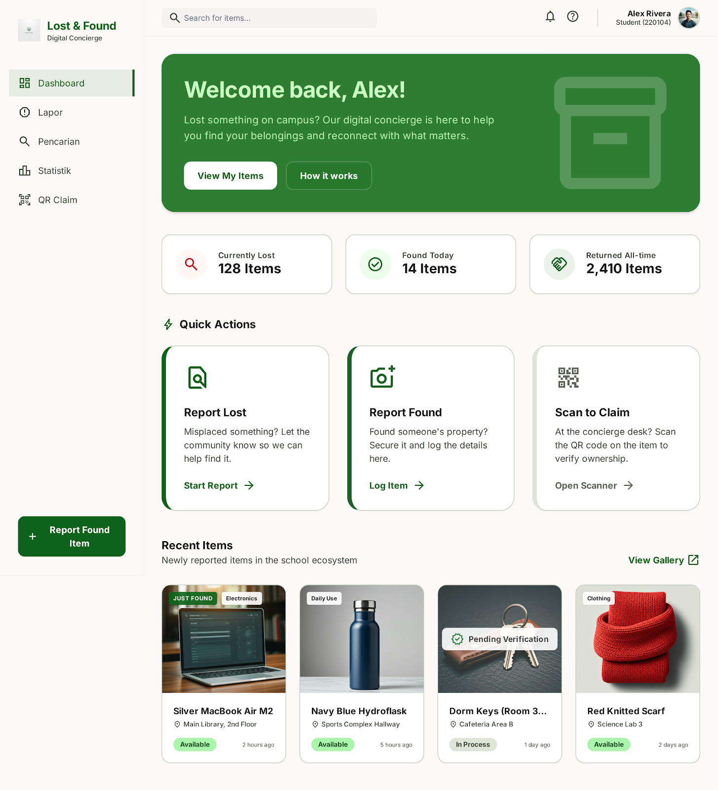

<p align="center">
  
</p>

<h1 align="center">QReturn</h1>

<p align="center">
  <strong>Lost & Found System for SMKN 2 Depok</strong><br>
  Reconnecting students with their belongings, one QR scan at a time.
</p>

<p align="center">
  
  
  
  
  
  
</p>

---

## Features

| Feature | Description |
|---------|-------------|
| **QR Authentication** | Login via student card QR scan (NISN-based) — no passwords required |
| **Email/Password Auth** | Supabase Auth with email verification |
| **Item Reporting** | Report lost or found items with photos, location, and category |
| **Live GPS Location** | Pinpoint item location using device GPS with interactive Leaflet map |
| **Real-time Chat** | Built-in chat via Socket.IO for founders and claimers to coordinate |
| **QR Claim System** | Each found item generates a unique QR code; owners scan to verify |
| **Real-time Notifications** | Supabase Realtime broadcasts for instant notification updates |
| **Verification Workflow** | Semi-manual verification — founder reviews and finalizes ownership |
| **Search & Filter** | Browse items by text, type (lost/found), and category |
| **Statistics Dashboard** | Visual charts for items per day, categories, and fun facts |
| **Bauhaus Design System** | Animated geometric shapes (dots, squares, lines) with CSS-driven float, orbit, pulse, and spin animations — centralized in `App.vue` as a full-page backdrop across all routes |
| **Dark Mode** | Full dark mode support with system-aware toggling |
| **i18n** | Indonesian and English language support |
| **Retention Policy** | Unclaimed items auto-deleted after 10 days; returned items after 2 |
| **Smart Item Matching** | When reporting a lost item, the system automatically finds matching found items by category, area, name/description keywords, and GPS proximity — then sends a suggestion notification |

### 🤖 Smart Item Matching

When a lost **or** found item is reported, QReturn automatically searches for matches using a **3-pass query engine**:

1. **Same category + same area** — highest confidence matches (limit 30)
2. **Same category only** — broader scope within your category (limit 20)
3. **Text keyword match** — finds items across all categories whose name/description contains your item's keywords (limit 10)

Each candidate is scored by the following factors:

| Factor | Points | Condition |
|--------|--------|-----------|
| Exact name match | **+80** | Lost item name === found item name (case-insensitive, trimmed) |
| All name words match | **+50** | Every meaningful word in lost name appears in found name |
| Full phrase match | **+30** | Lost item name appears in found name + description |
| Keyword in found name | **+15** / keyword | Non-basic keyword from lost item in found name |
| Keyword in found desc | **+5** / keyword | Non-basic keyword in found description |
| Basic keyword in name | **+3** / keyword | Generic criteria (colors, materials, sizes, common items) in found name |
| Basic keyword in desc | **+1** / keyword | Generic criteria in found description |
| Category match | **+14** | Same category (only if textScore > 0) |
| Area match | **+14** | Same area category (only if textScore > 0) |
| GPS < 100m | **+10** | Haversine distance < 100m |
| GPS 100–500m | **+5** | Haversine distance 100–500m |
| GPS 500–1000m | **+1** | Haversine distance 500–1000m |

A match with **total score ≥ 40** triggers a **"This might be your item"** notification and appears as a suggestion card in **My Reports**. Matches run bidirectionally — both lost and found item creation scans for counterparts.

> 📖 Full documentation: [`docs/matching-system.md`](docs/matching-system.md)

---

## 🛠 Tech Stack

| Layer | Technology |
|-------|-----------|
| **Frontend** | Vue 3 (Composition API, `<script setup>`), Vite 8, TypeScript 6 |
| **Styling** | Tailwind CSS v4 (CSS-based config, no PostCSS) |
| **Backend** | Node.js, Express 5, CommonJS |
| **Database** | Supabase PostgreSQL with Row Level Security (RLS) |
| **Auth** | Supabase Auth (email/password + QR flow via backend) |
| **Real-time** | Socket.IO 4 (chat only) + Supabase Realtime (notifications) |
| **QR** | `html5-qrcode` (scanner), `qrcode.vue` (generator) |
| **Maps** | Leaflet + OpenStreetMap tiles |
| **Uploads** | Cloudinary via multer-storage-cloudinary (5MB limit) |
| **Animations** | LottieFiles (`@lottiefiles/dotlottie-vue`), custom CSS keyframe animations (Bauhaus float, orbit, pulse, spin) |

---

## 📁 Project Structure

```
QReturn/
├── src/                    # Frontend (Vue 3)
│   ├── views/              # Page components (13 routes)
│   ├── components/         # Reusable components
│   │   ├── BauhausBackground.vue  # Full-page animated Bauhaus decor (centralized in App.vue)
│   ├── lib/supabase.ts     # Supabase client (frontend)
│   ├── router/index.ts     # Route definitions + auth guard
│   ├── config/http.ts      # Axios instance (Supabase session)
│   ├── composables/        # useCache, useToast, useNotifications
│   └── i18n.ts             # Custom i18n (EN/ID)
├── backend/                # Backend (Express 5)
│   ├── server.js           # API routes, Socket.IO, cron jobs
│   ├── lib/supabase.js     # Supabase admin client (service role)
│   ├── middleware/          # Auth, cache, upload middleware
│   └── config/             # Cloudinary config
├── supabase/
│   └── migrations/         # SQL schema with RLS policies
├── public/                 # Static assets
├── .env                    # Environment variables
├── vite.config.ts
├── package.json
└── tsconfig*.json
```

---

## 🚀 Getting Started

### Prerequisites

- **Node.js** >= 20.19 or >= 22.12
- **npm** >= 10
- **Supabase** project (free tier works)
- **Cloudinary** account (for image uploads)

### Installation

```bash
# Clone the repository
git clone https://github.com/your-username/QReturn.git
cd QReturn

# Install all dependencies (root + backend)
npm install
cd backend && npm install && cd ..
```

### Configuration

1. Create a Supabase project at https://supabase.com
2. Run the SQL migration in Supabase Dashboard → SQL Editor:
   - Copy contents of `supabase/migrations/001_initial_schema.sql`
   - Execute to create tables, RLS policies, and triggers

3. Create a `.env` file in the root directory:

```env
PORT=5005
VITE_API_URL=http://localhost:5005
FRONTEND_URL=http://localhost:5173

# Supabase (from Project Settings → API)
SUPABASE_URL=https://your-project.supabase.co
SUPABASE_ANON_KEY=your_anon_key
SUPABASE_SERVICE_ROLE_KEY=your_service_role_key

# Vite env vars (prefixed with VITE_)
VITE_SUPABASE_URL=https://your-project.supabase.co
VITE_SUPABASE_ANON_KEY=your_anon_key

# Cloudinary (optional — falls back to no image otherwise)
CLOUDINARY_CLOUD_NAME=your_cloud_name
CLOUDINARY_API_KEY=your_api_key
CLOUDINARY_API_SECRET=your_api_secret
```

4. Configure Supabase Auth email templates:
   - Go to Auth → Email Templates → Confirm signup
   - Set redirect URL to: `http://localhost:5173/verify-email`

### Development

```bash
# Runs frontend (:5173) + backend (:5005) concurrently
npm run dev
```

### Build for Production

```bash
npm run build
```

### Type-Check

```bash
npm run type-check
```

---

## 🧭 Routes

| Path | Page | Auth |
|------|------|------|
| `/` | Login | Guest only |
| `/verify-email` | Email Verification | Guest only |
| `/dashboard` | Dashboard | Required |
| `/report` | Report Item | Required |
| `/my-reports` | My Reports | Required |
| `/search` | Search Items | Required |
| `/statistics` | Statistics | Required |
| `/scan` | QR Scanner | Required |
| `/claim/:id` | Claim Item | Required |
| `/item/:id` | Item Detail | Required |
| `/tutorial` | Tutorial | Required |
| `/developer` | Developer Page | Required |
| `/rating` | Rate App | Required |

---

## 🔐 Authentication Flow

QReturn supports two login methods:

### QR Code Login
1. Student scans their physical ID card QR code
2. Backend creates/finds Supabase Auth user via admin API
3. Returns a valid Supabase session token
4. Frontend stores token and redirects to dashboard
5. **No email verification required** for QR users

### Email/Password Login
1. User registers with email, name, and password
2. Supabase sends a confirmation email
3. User clicks link → redirected to `/verify-email`
4. Email verified → auto-login → dashboard
5. Existing users can login directly without re-verification

See `loginflow.md` for detailed authentication flow diagrams.

---

## 🔒 Security

- **Row Level Security (RLS)**: All database tables have RLS policies
- **Supabase Auth**: Industry-standard JWT with automatic token refresh
- **Rate Limiting**: Auth (20/15min), Global (500/15min), Socket (20/10s)
- **Server-side caching**: GET responses cached, invalidated on writes
- **CORS**: Restricted to allowed origins in production

---

## 📸 Preview

<p align="center">
  
</p>

---

## 📄 License

This project is developed for **SMKN 2 Depok** educational purposes.

---

<p align="center">
  Built with ❤️ for the SMKN 2 Depok community
</p>
